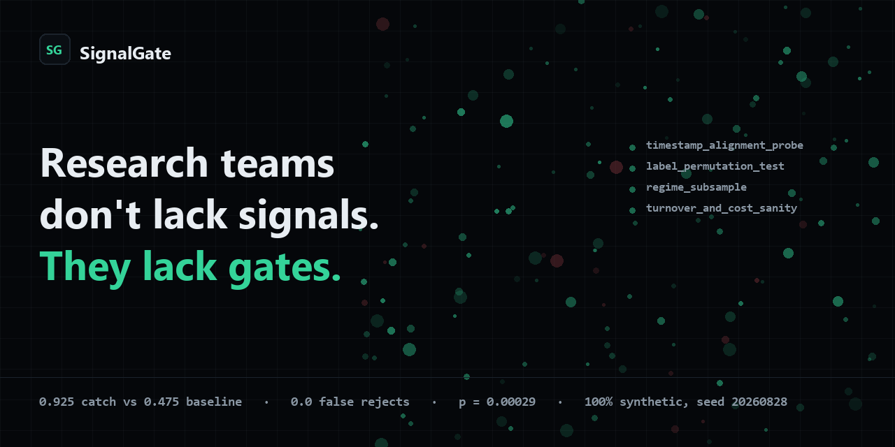

# SignalGate

<p align="center">
  
</p>

**research teams don't lack signals, they lack gates. SignalGate sells silence for the research pipeline - spurious signals die with receipts; only signals that deserve a researcher's hour reach a human.**

SignalGate is an agentic research-integrity gate: candidate trading signals are investigated like fraud cases - statistical probes as tools, verdicts with receipts, silence unless a signal deserves a researcher's hour.

> Disclosure (micro1 ground rule 02): design informed by the builder's prior fraud-defense work (Gatehouse: recommend-never-act, evidence bundles, honest eval discipline). Zero code imported. Repo is MIT.

## Who has this problem

**Junior quant researchers and quant PMs at prop shops and hedge funds, and the risk officers who must audit vendor signals.** Their pipeline receives dozens of candidate signals a week from LLM idea generators, vendor feeds, and papers.

## The bottleneck

Manual review of one candidate costs 60-90 minutes: read the spec, rebuild the backtest, hunt for lookahead. Most candidates are spurious, so the scarce resource is researcher hours, and review committees do not scale. Static linters catch syntactic tricks like `shift(-1)` and nothing else: lookahead hidden in prose, a universe of survivors, forty silently screened variants, and cost miracles all pass. No one publishes honest precision and recall for this task, so teams cannot even tell whether their screening works.

## Why solving it matters

A gate that kills spurious signals with receipts converts 60-90 minutes of skilled time per rejection into a 3-minute evidence skim, and, more valuable, it makes false rejections measurable so the firm stops throwing away real alpha. The expected researcher-hours wasted per spurious signal goes to near zero for covered flaw families, and every rejection leaves an audit artifact a risk officer can sign. SignalGate recommends, never trades: the human researcher remains the qualified reviewer.

---

## What existed before vs what was added (ground rule 02)

Before the sprint: nothing but the six specification documents in `docs/`
(authored and frozen on Aug 28). Built during the sprint: everything else in
this repository - the generator, the gate, the agent, the probes, the eval
harness, the frontend, and every number in `reports/`. The disclosure above
covers design lineage; zero code was imported from anywhere.

## What it does

SignalGate investigates each submission:

1. **Static lint** - AST/regex rules over the structured spec (future shifts, survivor universes, disclosed selection counts).
2. **Investigator agent** (one LLM; LOCAL_MOCK for zero-key repro) - extracts claims, flags contradictions, sizes the multiple-testing correction, selects probes.
3. **Four verification probes** on 100% synthetic seeded data, each in a sandboxed subprocess:
   - `timestamp_alignment_probe` - IC collapse under leak-proof re-execution (fields lagged by their disclosure lag + the program's own forward references; universe restricted to point-in-time membership)
   - `label_permutation_test` - permutation p (199 within-day shuffles), Šidák-deflated for hidden variant selection
   - `regime_subsample` - per-regime leak-proof IC + active-day shares
   - `turnover_and_cost_sanity` - implied turnover vs declared costs; miracle flag
4. **Verdict composer** - thresholds in code, never in the model. `REJECT_SPURIOUS` / `NEEDS_REVIEW` / `PROMISING`, each with confidence, reason codes, and the two strongest numeric receipts.
5. **Evidence bundle** - every run persists `bundle.json` / `bundle.md` / `trajectory.json` (agent spans: instruction → tool response → feedback → checkpoint).

Verdicts are advisory. The researcher decides. No execution capability exists anywhere in the tool registry.

## Measured results (v0, LOCAL_MOCK, seed 20260828)

60 seeded cases across six strata (48 dev / 12 sealed hold-out) - generator in [`generator/`](generator/), design in [docs/04-evaluation.md](docs/04-evaluation.md):

| Metric | Baseline (static lint) | Agent solution | Change |
|---|---|---|---|
| Spurious catch rate (dev, 40 flawed) | 0.475 (95% CI [0.325, 0.630]) | **0.925** (95% CI [0.801, 0.974]) | +0.450 |
| - sealed hold-out (10 flawed) | 0.5 | **0.9** | +0.4 |
| F2 catch (prose-hidden lookahead) | 0.0 | **1.0** | +1.0 |
| False-reject rate (sound signals) | 0.0 | **0.0** (bar: ≤ 0.05) | - |
| Human time per task | 60-90 min manual | ~3 min evidence review | -95% |
| Cost per task | $0 | $0.00 mock / ≤$0.05 live (measured spend, breaker-capped) | disclosed |

McNemar paired test on the dev split: agent-only correct 20, baseline-only correct 2 - p = 0.00029. Every number above regenerates byte-identically from `make data && make baseline && make agent && make eval` (asserted by `python -m signalgate.eval.repro` in CI). Full tables with Wilson CIs: [reports/comparison.md](reports/comparison.md), hold-out in [reports/comparison_holdout.md](reports/comparison_holdout.md), stage-by-stage ablation in [reports/ablation.md](reports/ablation.md).

**Improvement changelog (docs/04 §9, actually run)** - baseline lint catch 0.475 with F2 ≈ 0; a bare-prompt agent without verification tools hit catch 1.0 but **falsely rejected 0.875 of sound specs** (hallucinated checks); adding the four probes restored false-reject to 0.0 at catch 0.925 (the main contribution); a second "regime narrative" agent added +40% tokens for no accuracy gain and was removed. Details and receipts: [IMPROVEMENT_CHANGELOG.md](IMPROVEMENT_CHANGELOG.md).

**Honest misses** (failure taxonomy, docs/04 §8): `f3_08` (survivor universe on a momentum combo - the backtest survives point-in-time verification, labeled `PROMISING`; a labeling dispute), `f3_07`/`f5_04`/`f4_06` (marginal signatures → `NEEDS_REVIEW` instead of reject). They become v1 roadmap items, not shame.

## Quickstart (clean machine, zero keys)

```bash
git clone <repo> && cd signalgate
make install          # pip sync from requirements-lock.txt
make data             # seeded synthetic market + 60 cases (seed=20260828)
make eval             # baseline + agent over dev split, comparison table + CIs
make serve            # web gate at http://localhost:8000
```

Windows without make:

```bash
py -3.12 -m pip install -r requirements-lock.txt && py -3.12 -m pip install -e . --no-deps
py -3.12 -m generator.build --out data
py -3.12 -m signalgate.eval.run --system both --split dev --out artifacts/eval
py -3.12 -m signalgate.eval.score --baseline artifacts/eval/baseline --agent artifacts/eval/agent --out reports
py -3.12 -m uvicorn signalgate.api.app:app --port 8000
```

Then paste a spec from `generator/examples/` into the gate - verdict card in < 60 s. Full script: [REPRODUCTION.md](REPRODUCTION.md).

```bash
signalgate check generator/examples/f2_01.yaml   # CLI: verdict card + bundle
signalgate digest                                 # "48 screened. 37 rejected with receipts…"
```

## Architecture (one paragraph)

FastAPI + Jinja2/Tailwind/HTMX (zero node build) + Typer CLI over one deterministic orchestrator: models decide **within** stages, code decides **between** stages; verdicts come from probe numbers and thresholds in `signalgate/orchestrator/thresholds.py`; narrative prose is generated last. Probes run on synthetic data only, in subprocesses with CPU/memory caps and no network. Degradation is tested, not aspirational: model down or spend breaker tripped → lint-only `NEEDS_REVIEW` with a plain `DEGRADED_MODEL` banner; probe timeout → `PROBE_SKIPPED` disclosed; schema fail → reasoned `REJECTED_INVALID`. Full C4 views, probe contracts, and the ground-rule compliance map: [docs/03-architecture.md](docs/03-architecture.md).

## Live demo and deployment

Run it locally (two commands above), or deploy free: backend on Render,
frontend on Vercel, five minutes, env-only config. Exact steps:
[DEPLOY.md](DEPLOY.md). The gate page also has a bring-your-own-model panel:
any OpenAI-compatible endpoint and key pasted by a visitor stays in their
browser and is used for their request only.

## Repository map

```
docs/                      # locked doc set (01 vision · 02 product · 03 architecture
                           #   · 07 evaluation · 10 reproduction · 12 pitch)
src/signalgate/            # lint/ · agent/ · probes/ · orchestrator/ · api/ · ui/ · eval/
generator/                 # seeded market sim + flaw injector + 60 cases + examples/
scripts/routing_ritual.py  # live model-ID verification (honest SKIP without keys)
trajectories/              # agent trajectories: runtime runs + coding-agent sessions
tests/                     # 62 tests: units, degradation chaos, API contract, byte-identical repro
SUBMISSION.md              # deliverables and ground-rule register, claims mapped to artifacts
Makefile · pyproject.toml · Dockerfile · requirements-lock.txt · LICENSE(MIT) · NOTICE
```

## Ground-rule compliance

Synthetic data only (rule 07) · probes sandboxed, no consequential actions (04) · verdicts advisory, human is the qualified reviewer (05) · env-only credentials, `.env` gitignored, `scripts/secret_scan.py` in CI (08) · every claim → an artifact in `reports/` or `artifacts/` (09) · one-command zero-key repro (10) · MIT + dependency licenses in [NOTICE](NOTICE) (03).

## Documentation index

[01-vision](docs/01-vision.md) · [02-product-spec](docs/02-product-spec.md) · [03-architecture](docs/03-architecture.md) · [04-evaluation](docs/04-evaluation.md) · [05-reproduction](docs/05-reproduction.md) · [06-pitch](docs/06-pitch.md) · [07-article](docs/07-article.md)
