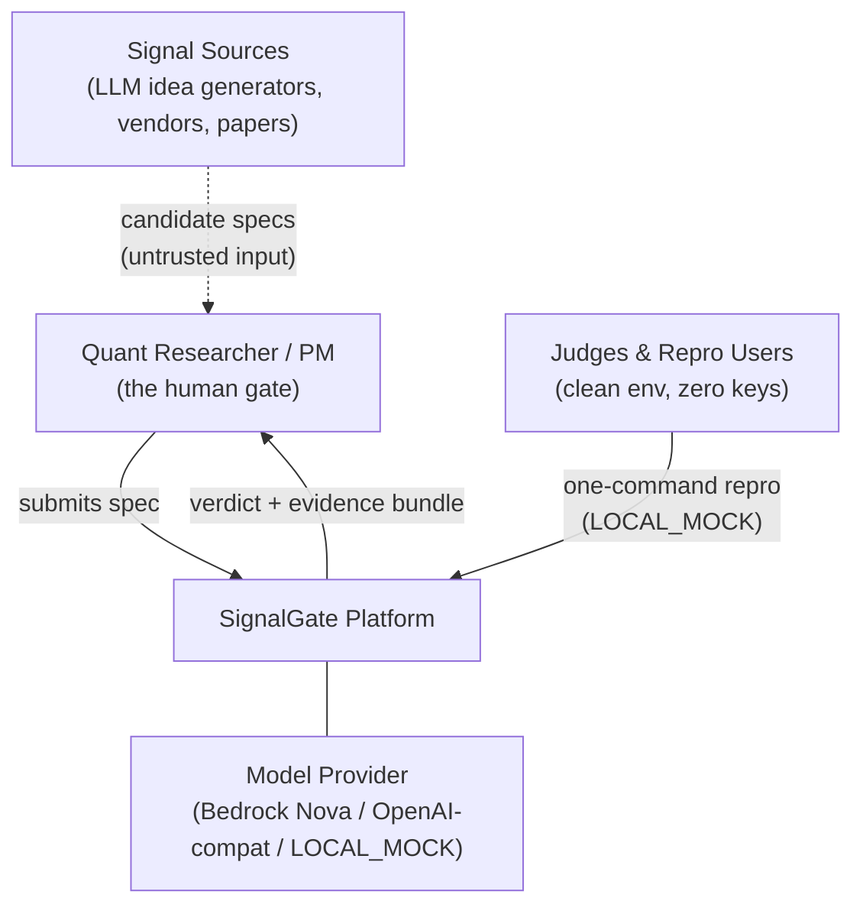
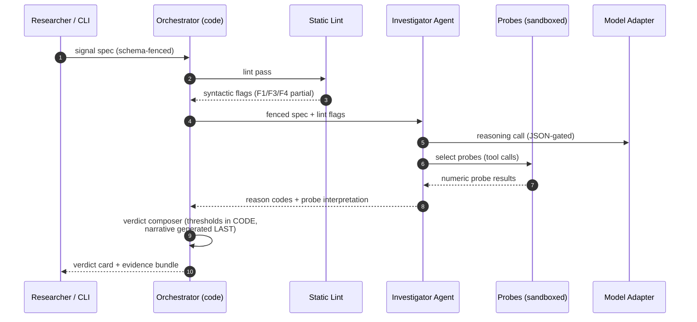
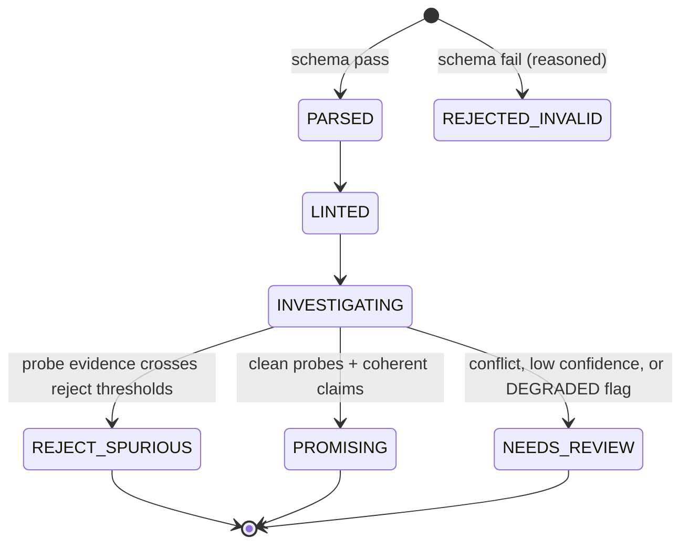

# docs/03-architecture.md

| Field | Value |
|---|---|
| Version | 0.1.0 |
| Status | Build-locked |
| Owner | Prakhar Shukla |
| Depends on | 01, 02 |
| Last updated | 2026-08-28 |

## 1. Tech stack (choices + rationale)
| Layer | Choice | Rationale |
|---|---|---|
| Language | Python 3.12 | Ecosystem for numerics + agents; micro1-supported |
| API | FastAPI + uvicorn | Swagger for free; JSON contract testable |
| UI | Server-rendered Jinja2 + Tailwind + HTMX | Real product feel, **zero node build**, one service, deploys anywhere; deliberately not a single static HTML page and not a heavy SPA |
| CLI | Typer | Pipeline-native usage |
| Validation | Pydantic v2 | Spec + agent output schemas gated by jsonschema |
| Numerics | numpy + pandas | Probes |
| Tests / lint | pytest, ruff | CI gates |
| Packaging | uv + requirements-lock.txt | Byte-identical installs |
| Deploy | Docker single service → Render or Fly.io | One URL judges can click; env-configurable |
| State | Stateless; artifacts on disk (JSON/markdown) | No DB to provision; reproducibility trivial |
| Observability | Structured logs + span records per stage | Trajectory export source |

## 2. System context (C4 L1)

Trust boundary: every spec is untrusted input; it enters through schema fencing before any component touches it.

## 3. Container view (C4 L2)

```mermaid
flowchart TB
    subgraph Surfaces["Human surfaces"]
        WEB["Web Gate<br/>FastAPI + Jinja2/Tailwind/HTMX"]
        CLI["CLI (Typer)"]
    end
    subgraph Core["SignalGate core (one Docker service)"]
        ORC["Orchestrator<br/>(deterministic Python; code owns control flow)"]
        LINT["Static Lint<br/>(AST/regex rule suite)"]
        AGT["Investigator Agent<br/>(one LLM, fenced prompts, JSON-gated)"]
        PRB["Probe Tools x4<br/>(sandboxed subprocess, synthetic data only)"]
        SIM["Synthetic Market Sim<br/>(seeded regime-switching paths)"]
        ADP["Model Adapter<br/>LIVE · LOCAL_MOCK"]
        BUN["Evidence Store<br/>(disk artifacts, hash-named)"]
        BRK["Spend Meter + Breaker"]
    end
    subgraph Eval["Evaluation harness (doc 07)"]
        GEN["generator/"] --> RUN["runner/"]
        RUN --> SCO["scorers/"] --> REP["reports/"]
    end
    WEB --> ORC
    CLI --> ORC
    ORC --> LINT
    ORC --> AGT
    AGT <--> PRB
    PRB --> SIM
    AGT <--> ADP
    ORC --> BUN
    AGT --> BRK
    RUN --> ORC
```

## 4. Investigation sequence

## 5. Verdict lifecycle

## 6. Orchestrator law (carried from Gatehouse)
Models decide **within** stages; code decides **between** stages. Verdicts come from probe outcomes + reason-code thresholds in code, never from vibes. Narrative prose is generated last and is the only generated text.

## 7. Degradation matrix (tested, not aspirational)
| Failure | Behavior | User-visible effect |
|---|---|---|
| Model down / auth fail | Lint-only run, verdict `NEEDS_REVIEW` + `DEGRADED_MODEL` | Plain banner: verification incomplete |
| Probe timeout | Probe skipped, `PROBE_SKIPPED` disclosed in bundle | Weaker evidence, shown honestly |
| Parse fail | `REJECTED_INVALID` with field-level reasons | Actionable error |
| Breaker trips | All runs drop to lint-only; alarm in logs | Cost protection active banner |

## 8. Probe tool contracts (the 30-point core)
| Tool | Input | Output | Constraints |
|---|---|---|---|
| `timestamp_alignment_probe` | spec, synthetic prices | IC/Sharpe delta when labels are shifted to remove future info | subprocess, CPU/mem caps, **no network**, 10 s timeout |
| `label_permutation_test` | spec, prices | empirical p-value of observed IC over 199 permutations | seeded; budget-capped |
| `regime_subsample` | spec, prices | per-regime IC table (bull/bear/sideways) + stability score | synthetic regimes only |
| `turnover_and_cost_sanity` | spec | implied turnover vs declared costs; miracle flag | pure math, no model |

Allowlist rule (rules 04/05): probes execute **only on synthetic data** in sandboxed subprocesses; the product has no execution, no external market-data calls, no consequential actions; the human researcher is the qualified reviewer of every verdict.

## 9. Model routing policy
| Job | Primary | Fallback | Notes |
|---|---|---|---|
| Investigation reasoning | `amazon.nova-pro-v1:0` (ap-south-1) | `amazon.nova-lite-v1:0` | verified by ritual |
| Alt provider (portability) | any OpenAI-compat via `SIGNALGATE_MODEL` + `SIGNALGATE_API_BASE` | - | env override |
| Repro / judges | `LOCAL_MOCK` (canned reasoning keyed by case seed) | - | zero keys, byte-identical |

`scripts/routing_ritual.py` re-verifies every routed ID live from the deploy region (one capped invocation each); results append here with dates, Gatehouse doc style. JSON via prompt + fence-stripping + jsonschema gate (no native responseFormat assumed).

## 10. Deployment topology
Single Docker service (web + API + CLI entrypoint). Render web service or Fly.io; env vars for keys only in LIVE mode; rate limit 30 req/min/IP; spend breaker default $2/run cap; `/healthz`, `/docs` (swagger), `/` (gate UI), `POST /investigate`. Staging URL stays live through judging period.

## 11. Ground-rule compliance map
| Rule | Implementation |
|---|---|
| 02 prior art | README disclosure line (01 §5) |
| 04 sandbox | probes subprocess-capped, synthetic-only |
| 05 human reviewer | verdicts advisory; researcher decides |
| 07 data | 100% synthetic seeded generator |
| 08 credentials | env-only; `.env` gitignored; CI asserts no secrets |
| 09 evidence | every claim → metrics.json / bundle artifact |
| 10 access | one-command LOCAL_MOCK repro + live URL |

## 12. Acceptance criteria
Clean `docker build` passes in CI; sequence §4 replayable from stored spans; every degradation row has a chaos test passing before submit.
