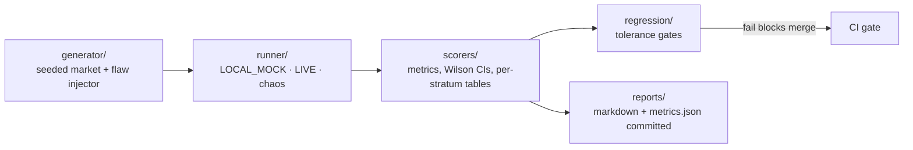

# docs/04-evaluation.md

| Field | Value |
|---|---|
| Version | 0.1.0 |
| Status | Build-locked |
| Owner | Prakhar Shukla |
| Depends on | 03 |
| Last updated | 2026-08-28 |

## 1. Philosophy
Unmeasured agents are toys. Every claim in the README traces to a number this harness produces, seeded and reproducible, with limitations published beside it.

## 2. Dataset design (synthetic, rule 07)
Generator: regime-switching GBM, 50 assets × 750 days, seeded. Flaw injector templates per family; sound templates include cost-aware momentum and value with proper universes. Every case carries ground truth: family, injected mechanism, expected verdict.

| Stratum | Count | Injection example |
|---|---|---|
| F1 lookahead-syntactic | 10 | `rank(close.shift(-1) / close - 1)` style future refs |
| F2 lookahead-semantic | 12 | prose: "score by how strongly management sounds about next quarter, priced at quarter-end" |
| F3 survivorship | 10 | universe = today's constituents only |
| F4 p-hacking | 10 | best-of-40 hidden variant selection, no correction |
| F5 regime-overfit | 8 | params fit to single bull window |
| S0 sound | 10 | cost-aware, point-in-time universe, deflated significance |

Composition 60 cases. Split: 48 dev / 12 sealed hold-out (different seed, never opened during development; opened exactly twice: mid-build sanity, final). Runs on hold-out log seed + prompt versions.

## 3. Metrics
| Metric | Definition | v0 bar |
|---|---|---|
| **Primary: spurious catch rate** | TP reject / all F1-F5 | ≥ 0.85 (agent) |
| False-reject rate | S0 rejected / all S0 | ≤ 0.05 (guard) |
| Precision (reject) | TP / (TP+FP) | tracked, reported |
| Per-stratum catch | breakdown table | F2 catch ≥ 0.75 (the semantic jump) |
| Human time per task | manual 60-90 min → evidence review ~3 min | reported |
| Cost per task | USD mean/p95 | ≤ $0.05 LIVE; $0 MOCK |
| Latency p50/p95 | submit → verdict | ≤ 20 s / ≤ 60 s |

## 4. Comparison format (PDF's simple table, filled)
| Metric | Simple baseline (static lint) | Agent solution | Change |
|---|---|---|---|
| Spurious catch rate | ~0.45 (F1 + partial F3/F4) | ≥ 0.85 | +0.40 |
| Human time per task | 60-90 min manual | ~3 min review | -95% |
| Cost per task | $0 | ~$0.03 | disclosed; buys the semantic catch |

Same cases for both; resource difference explained (baseline: 0 tokens; agent: LLM + 4 probes).

## 5. Statistical honesty rules
Wilson 95% CIs on proportions. McNemar paired test baseline-vs-agent on the same set. No tuning on hold-out, ever. Seed, model IDs, prompt versions, pack/generator versions embedded in `metrics.json`; one command regenerates byte-identical.

## 6. Runner modes
`LOCAL_MOCK` (stub model, canned reasoning keyed by seed; zero keys), `LIVE` (real models, budget-capped, breaker shared). Chaos wrap: model-timeout and probe-timeout injection matching §7 degradation matrix.

## 7. Regression gates (CI)
PR-level (fast, offline): schema validation of agent outputs, lint suite, prompt-lint, mock eval catch-rate floor. Nightly: capped LIVE 20-case replay; tolerance (catch -0.02, false-reject +0.01, cost +20%) fails the build.

## 8. Failure taxonomy (required appendix)
Every miss classified: `missed_pattern_family`, `probe_gap`, `prompt_gap`, `threshold_miscalibration`, `orchestration_bug`, `labeling_dispute`. Counts published; failures become v1 roadmap, not shame.

## 9. Improvement changelog protocol (pre-planned stages; must be actually run)
| Stage | Tried & why | Evidence | Decision |
|---|---|---|---|
| Baseline | static lint | catch ~0.45, F2 ≈ 0 | starting point |
| Iter 1 | bare-prompt agent, no tools | F2 catch up but hallucinated checks → false-reject breach | tools needed |
| Iter 2 | +4 verification probes | catch ≥ 0.85, false-reject ≤ 0.05 | kept; main contribution |
| Iter 3 | second "regime narrative" agent | cost +40%, no gain | **removed** |
| Final | lint + tool-agent | final table | identified main contribution |

## 10. Harness components

## 11. Acceptance criteria
One command reproduces every published number. All metrics computable in CI without manual steps. Taxonomy populated from real misses at release gate.
