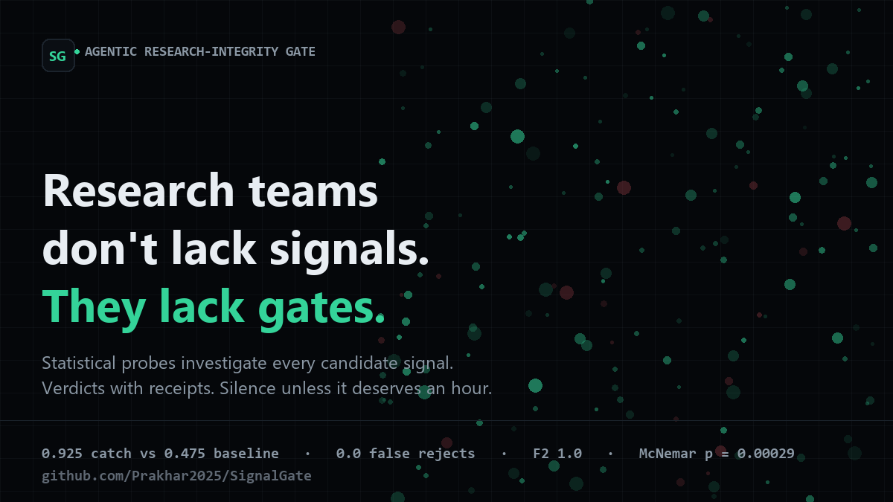
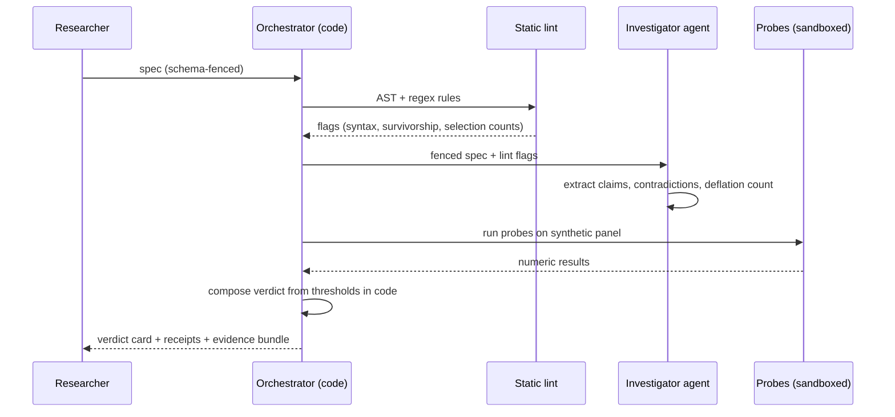

# SignalGate: An Agent That Investigates, and Code That Decides

*An engineering deep dive into building a research-integrity gate for candidate trading signals: a leak-proof re-execution engine, a permutation null that almost fooled its own authors, a benchmark designed so its authors cannot cheat it, and an ablation in which a confident agent falsely rejected 87.5% of the good book.*



---

Quant research teams are about to drown, and they know it. LLM idea generators, vendor feeds, and paper-mining pipelines now produce candidate trading signals faster than any review committee can read them. The failure mode of a bad candidate is not a crash. It is a plausible backtest that survives until real money meets real time, and by then the only person who can debug it is the person who built it, six months ago, against data nobody can audit.

Manual review is the current control. It costs 60 to 90 minutes per signal: read the spec, rebuild the backtest, hunt for information leakage. Most candidates are spurious, so the firm pays senior-engineer hours by the barrel to say no. Static tooling barely helps: a linter catches `shift(-1)`, the syntactic tell of tomorrow's price leaking into today's score, and stops there. The four failures that actually make backtests lie are invisible to syntax:

1. **Semantic lookahead.** The formula is clean; the vendor field inside it is not. "Management tone" stamped with the quarter it describes and merged after the fact is tomorrow's information wearing yesterday's timestamp.
2. **Silent selection.** Forty parameterizations screened on one window, the survivor shipped uncorrected. Its in-sample significance is precisely what best-of-40 noise produces.
3. **Survivorship.** The universe is "today's constituents", so every delisting, which is to say every disaster, is invisible.
4. **Regime overfit and cost amnesia.** Parameters tuned to one bull window, or a strategy whose own trading costs exceed its edge, presented at gross.

This post is the full engineering story of SignalGate, an agent gate built in a three-day sprint: a leak-proof re-execution engine, a permutation null redesigned halfway through because the first one lied, a benchmark whose authors cannot quietly cheat it, and an ablation whose most important number is an embarrassment that became the thesis. Everything below is measured, seeded, and regenerates byte-identically from one command.

## Table of contents

1. [The design bet: models propose, code decides](#1-the-design-bet)
2. [The data engine: manufacturing an honest adversarial world](#2-the-data-engine)
3. [The leak-proof re-execution engine](#3-the-leak-proof-engine)
4. [The permutation test, and the null that almost fooled us](#4-the-permutation-test)
5. [Regimes, active days, and the cost probe](#5-regimes-and-costs)
6. [The verdict composer](#6-the-composer)
7. [Results](#7-results)
8. [What 0.875 false rejects taught us](#8-the-ablation)
9. [What broke](#9-what-broke)
10. [Limitations, honestly](#10-limitations)
11. [Reproduce it](#11-reproduce-it)

## 1. The design bet

The two obvious architectures both fail, for instructive reasons.

**Pure rules** are the current state of the art and stop at syntax. Every attempt to extend a linter into prose understanding ("flag descriptions that *sound* like lookahead") either drowns in false positives or is trivially evaded by paraphrase.

**An autonomous LLM reviewer** fails differently. Ask a model to review a spec and you get a verdict that is fluent, confident, non-reproducible, and unauditable. In our measured ablation, a bare-prompt agent caught 100% of the flawed cases and falsely rejected 87.5% of the sound ones. It invented checks. It pattern-matched on surface features ("weekly rebalance with a 21-day horizon is stale") and shipped rejections with no evidence behind them. Fluency is not investigation.

So SignalGate draws the line as an explicit contract, version-stamped in the prompts and enforced in code:

> **Models decide within stages. Code decides between stages.** The agent extracts claims, flags contradictions, sizes the multiple-testing correction, and writes the final narrative. The verdict itself is composed by thresholds in plain Python from the outputs of four deterministic probes. The narrative is generated last, and it is the only generated text.

The consequences are measurable: every run regenerates byte-identically in LOCAL_MOCK mode, every verdict decomposes into numeric receipts, and the worst thing the model can do is write a bad paragraph.



## 2. The data engine

You cannot evaluate an integrity tool without cases of known ground truth, and no such dataset exists for trading signals. So SignalGate generates its own: a regime-switching market over 50 assets and 750 days, seeded to the byte. But a generator is only honest if its job is to make the detector's life hard. Three design choices do the work:

**Structure you can discover.** A world of pure noise rejects everything and proves nothing. The generator bakes real, discoverable cross-sectional structure into the returns: near-permanent per-asset alpha (which makes 12-1 momentum genuinely work, in every regime), short-horizon mean reversion with a bull-market-only component (which makes gated reversion genuinely regime-conditional), a low-volatility coupling, news fields that track the forward alpha path, and post-earnings-announcement drift with a 60-day decay. Sound templates exploit this structure and pass verification honestly. The magnitudes are stronger than real markets, and that is disclosed; what matters for the benchmark is that the flaws and the edge are generated by the same mechanics.

**Distress you cannot ignore.** Ten firms with the highest current alpha are selected to bleed: a 150-day negative drift ramp, volatility doubling, volume drying to 2% of baseline, delisting between days 620 and 736. These are the former winners that implode, and they are the raw material of survivorship: a backtest on "today's constituents" never sees them, which is exactly how survivorship inflates results in production research.

**Fields that ship broken.** The alt-data namespace deliberately contains both the point-in-time series and a peeking variant: `mgmt_tone_quarter` carries the aggregate of the quarter *in progress*, the way a forward-restated vendor merge actually looks. Using it is semantic lookahead, and nothing in the prose gives it away.

On top of this world, 60 cases are injected across five flaw families plus sound templates: 10 syntactic lookaheads, 12 semantic lookaheads, 10 survivor universes, 10 best-of-N selections, 8 regime-gated overfits, and 10 sound signals with honest parameters. Every case carries ground truth in the manifest, never in the spec. The split is 48 development, 12 sealed holdout, and the holdout was opened exactly once, at the final gate.

Disclosed limitation: the benchmark is self-authored. The guards are the false-reject criterion (below), the published calibration, per-case injection strengths, and a failure taxonomy that names the misses.

## 3. The leak-proof engine

The heart of the system is a simple question: does this signal's edge survive when every drop of future information is blocked? Answering it mechanically requires three things.

**A fenced DSL.** The spec's pseudocode is a small assignment program over named panel fields, compiled through a Python AST walk that whitelists methods, rejects lambdas and comprehensions, and computes the program's own peek depth: every `shift(x, -k)`, `lead(x, k)`, and `pct_change(x, -k)` is counted. (That third one took a bug report from our own test suite; `pct_change(close, -1)` is `shift(close, -1)` in disguise, and the scanner missed it on the first pass.)

**Leak-proof re-execution.** The same program runs twice. As written, with fields exactly as the researcher has them. Then point-in-time: every field lagged by its disclosure lag plus the program's own peek depth, and the universe restricted to the membership mask. The delta between the two mean rank-ICs is the alignment receipt. The flagship semantic case collapses from +0.475 to +0.023. A sound signal does not move.

**Labels that respect death.** The first market build had a subtle poison: delisted assets were frozen at their final price, which meant a crashing stock's forward 21-day return *recovered to zero* and every cross-sectional statistic downstream inverted; momentum priced negative. The fix is the correct convention: forward returns whose horizon crosses a delisting are unknowable, and are masked. One line, and the entire panel became measurable.

The survivorship probe falls out of the same machinery for free: the as-written run honors the spec's universe parameter (survivors), the leak-proof run ignores it and uses point-in-time membership. A reversion signal that backtests at +0.013 on survivors and -0.028 point-in-time has been caught buying its own survivorship.

## 4. The permutation test

Significance needs a null, and the first null we implemented was wrong in a way that is worth publishing.

The original design circularly shifted each asset's score in time, preserving autocorrelation while breaking cross-sectional alignment. Sound in theory. In practice, the sound signals are *slow*: a momentum score's day-over-day correlation is near one, so a circular shift of a slow series against the same labels reproduces something close to the observed statistic. The null collapsed onto the data. A genuinely strong signal reported p = 0.245.

The fix is the textbook null for rank-IC: shuffle the score across assets **within each day**. This severs the cross-sectional link the test is about while making no assumption about the score's own time-series structure. After the fix, sound signals report p = 0.005 and noise reports uniform p-values, exactly as the theory says.

On top of the raw p sits the deflation that catches hidden selection: the agent extracts the variant count from the submission (a "grid of 40" in the description, or a conservative k = 10 when selection language appears without a count) and the p-value is Šidák-corrected. A best-of-40 winner with raw p = 0.015 deflates to 0.45. The hack dies of arithmetic, and the receipt shows both numbers so the rejection explains itself.

## 5. Regimes and costs

Two probes finish the verification. The regime probe reports leak-proof mean IC per regime with **active-day shares**, a field added after the first gated signal fooled a simpler metric: a signal that sleeps through bear markets reported a flattering average because its inactive days silently dropped out of the mean. Active shares make the sleep visible. The cost probe z-scores the signal into positions, freezes them between rebalances, prices every unit traded at the spec's declared costs, and reports gross Sharpe, net Sharpe, and the daily drag in basis points. A gross of 2.4 with a net of -1.1 is reported as the miracle it is.

## 6. The composer

The verdict is a pure function of probe numbers and thresholds that live in one Python file: alignment collapse (delta over 0.10 with point-in-time IC under half the written IC), survivorship collapse (a written edge that vanishes to dead point-in-time), deflated significance over 0.10, a regime sign flip or an active share under 0.30, and the cost miracle. PROMISING requires the strict gate: deflated p at or below 0.02, alignment clean, every regime positive, net Sharpe above 0.3, and no skipped probe. Skipped probes weaken evidence and can never strengthen a verdict; under a model outage the gate drops to lint-only and stamps the run DEGRADED rather than improvising.

## 7. Results

Sixty cases, 48 development and 12 sealed, seed 20260828, LOCAL_MOCK, regenerating byte-identically:

| Metric | Static lint baseline | Agent solution |
|---|---|---|
| Spurious catch rate (dev, 40 flawed) | 0.475 | **0.925** (95% CI 0.801-0.974) |
| Prose-hidden lookahead (F2, 9 flawed) | 0.0 | **1.0** |
| False-reject rate (8 sound) | 0.0 | **0.0** |
| Precision (reject) | 1.0 | **1.0** |
| Sealed hold-out (10 flawed) | 0.5 | **0.9** |

McNemar's paired test on identical cases: 20 agent-only correct, 2 baseline-only correct, p = 0.00029. Human time per task falls from the 60-to-90-minute manual review to roughly three minutes of evidence reading. Runtime is about five seconds per investigation; the probes cap at ten seconds each in their subprocesses, and cost is $0.00 in LOCAL_MOCK, breaker-capped at $2.00 per run in LIVE.

## 8. What 0.875 false rejects taught us

The pre-planned ablation was executed, not reconstructed, and its most important number is the system's own failure. The bare-prompt stage, an agent answering from claims alone, caught every flawed case. It also rejected 35 of the 40 sound signals: 0.875 false-reject rate. It hallucinated checks ("costs at or under 10 bps is unrealistic", "weekly rebalance with a 21-day horizon is stale") and applied them with total confidence. Catch rate 1.0, trust destroyed.

Adding the four probes moved false-rejects to 0.0 at a catch of 0.925. A second narrative agent was measured at +40% tokens for no accuracy change and removed. The conclusion is the thesis: an agent without verification tools does not investigate. It improvises, fluently, and the fluency is the danger. The tools did not add intelligence; they disciplined it.

## 9. What broke

The build's own failure log, because it is the best evidence of how the system was actually made:

- **The ghost-price poison.** Freezing delisted assets at their final price made crashing stocks show positive forward returns, inverting momentum across the board. Found by a calibration sweep that refused to converge, fixed by masking unknowable horizons.
- **The degenerate null.** Described above: the first permutation design validated everything and meant nothing. Found because a sound signal reported p = 0.245 while its direct correlation was unambiguously positive.
- **The alpha trap.** Mean-reverting alpha made long-window momentum anti-predict in bear regimes, which collided with a benchmark that needs sound momentum to survive. The fix, near-permanent alpha characteristics, is a modeling decision documented in the generator.
- **The placeholder leak.** The p-hack cases ship pseudocode finalized by a selection search; the catalog carries a placeholder, and the first trajectory export leaked it into a submitted spec. The dataset loader now prefers the built YAMLs, and the builder asserts no placeholder can reach disk.
- **The sliding window.** The API rate limit failed its own test because the test made 31 investigations, each taking seconds, across a 60-second window. The limiter was right. The test learned what a minute is.
- **The stale dataset.** A late generator fix landed after the last dataset rebuild; the committed dataset.md described windows that a fresh build would not produce. The clean-room check (delete `data/`, regenerate, compare) caught it, and the committed reports now match the committed generator.

## 10. Limitations, honestly

The world is synthetic and self-authored; the calibration, per-case injection strengths, and miss names are published precisely so the circularity is visible and bounded. The agent's brain in the default mode is a deterministic mock, which is why every number regenerates without keys; LIVE mode routes the identical contracts to any OpenAI-compatible endpoint, but no published number depends on it. Four marginal cases land where the evidence puts them rather than where the ground truth wants them, and they are named. The Docker image path is provided but was not completed in the development environment; the supported judge path is the two-command local run.

## 11. Reproduce it

```bash
make install && make data && make eval && make serve
```

Zero keys, no downloads, 2 to 4 minutes on a laptop. `make repro-check` regenerates the evaluation twice and asserts the metrics file is byte-identical. 62 tests cover the probes, the composer thresholds, the degradation chaos paths, the API contract, and the reproducibility claim itself.

*Repository: github.com/Prakhar2025/SignalGate. MIT licensed. Verdicts are advisory; the researcher decides.*
